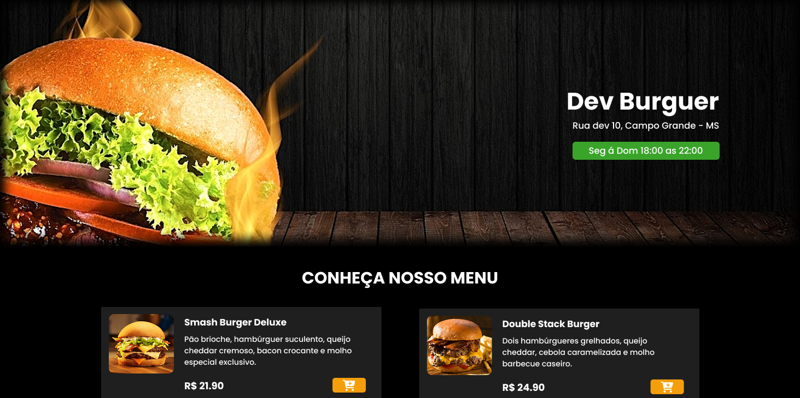
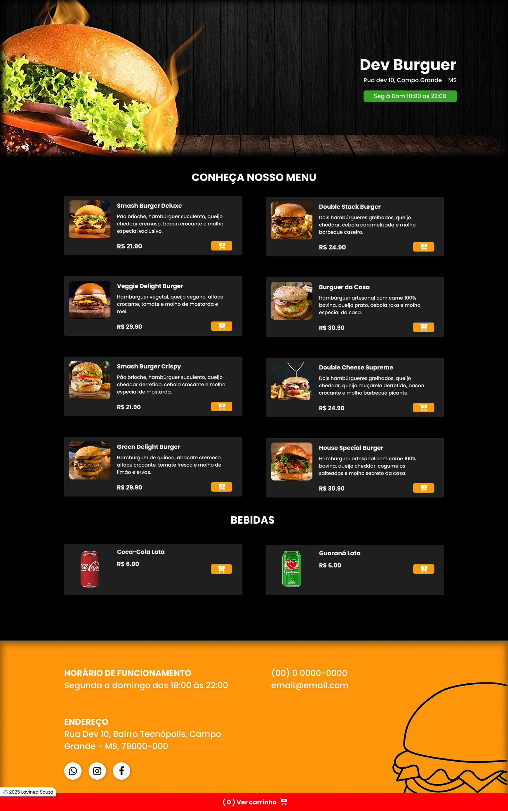
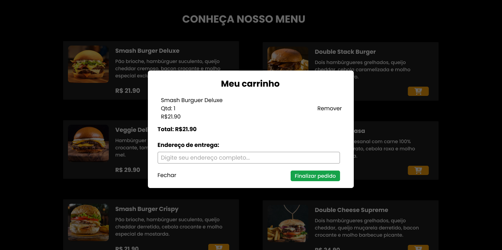
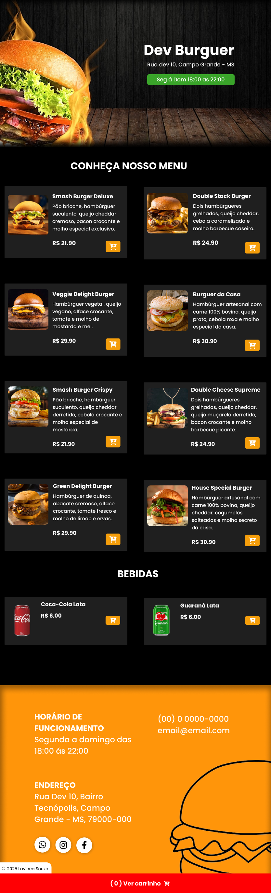

# Dev Burguer - Cardápio Online


**Desenvolvedora Front-End | React, Javascript,  HTML, Tailwind CSS**

Este projeto consiste na criação de um **cardápio online** para a **Dev Burguer**, uma hamburgueria moderna. O objetivo é fornecer uma plataforma onde os clientes podem visualizar o cardápio, adicionar itens ao carrinho e realizar a finalização do pedido diretamente via WhatsApp. O site foi desenvolvido utilizando **React**, **Tailwind CSS**, **HTML** e **JavaScript**, garantindo uma navegação simples, interativa e otimizada para diversos dispositivos.

## Visite o Cardápio

Confira o projeto ao vivo acessando o link abaixo:

[Visite o Dev Burguer Cardápio](devburguer-psi.vercel.app/)

## Sobre o Projeto

Este projeto foi criado para tornar o processo de escolha e compra de hambúrgueres mais fácil e direto. As principais funcionalidades incluem:

- **Cardápio Interativo**: Apresentação organizada dos hambúrgueres com descrições e preços.
- **Carrinho de Compras**: Permite que o cliente adicione itens ao carrinho e veja o total de sua compra.
- **Finalização via WhatsApp**: O pedido é finalizado com um simples clique, redirecionando o cliente para o WhatsApp do estabelecimento.
- **Design Responsivo**: A página se adapta automaticamente a diferentes dispositivos (desktop, tablet e celular).
- **Integração com React**: Utilização do React para gerenciar o estado da aplicação e renderizar o conteúdo dinamicamente.
- **Estilização com Tailwind CSS**: Utilização do Tailwind CSS para um design moderno e responsivo com baixo custo de manutenção.

## Tecnologias Utilizadas

Este projeto foi desenvolvido utilizando as seguintes tecnologias:

- **React**: Framework JavaScript para criar interfaces de usuário interativas e dinâmicas.
- **Tailwind CSS**: Framework de CSS para um design responsivo e estilização rápida e flexível.
- **HTML5**: Estruturação do conteúdo de forma semântica, facilitando o SEO.
- **JavaScript**: Funcionalidades interativas, como o carrinho de compras e animações de transição suave.
- **Vercel**: Plataforma de hospedagem para garantir o desempenho e a acessibilidade do site.

## Como Rodar o Projeto

Para executar o projeto localmente, siga os passos abaixo:

1. **Clone o repositório**:
    ```bash
    git clone https://github.com/devLavinea/burguerdev.git
    ```

2. **Instale as dependências**:
    Navegue até o diretório do projeto e execute o comando abaixo:
    ```bash
    npm install
    ```

3. **Inicie o servidor de desenvolvimento**:
    Após instalar as dependências, execute o comando:
    ```bash
    npm start
    ```
    O projeto estará disponível em `http://localhost:3000` no seu navegador.

## Funcionalidades

- **Cardápio Interativo**: Os clientes podem navegar pelo cardápio e adicionar hambúrgueres ao carrinho.
- **Carrinho de Compras**: O usuário pode visualizar os itens selecionados e o total da compra antes de finalizar.
- **Finalização no WhatsApp**: Ao clicar no botão de finalização, o cliente é redirecionado ao WhatsApp do restaurante com os itens do pedido prontos para envio.
- **Design Responsivo**: A página se adapta automaticamente a diferentes tamanhos de tela, garantindo uma boa experiência em dispositivos móveis e desktop.
- **Animações com React**: Transições suaves para melhorar a navegação na página, utilizando a renderização eficiente do React.
- **Estilização com Tailwind CSS**: O uso de classes utilitárias permite um design altamente personalizável e responsivo sem escrever muito CSS.
- **Estruturação para SEO**: O HTML foi otimizado para SEO, incluindo tags semânticas e meta tags.

## Como Contribuir

Se você quiser colaborar ou sugerir melhorias para o projeto, siga os passos abaixo:

1. Faça um fork deste repositório.
2. Crie uma nova branch para sua feature (`git checkout -b feature/nova-feature`).
3. Faça suas alterações e commit (`git commit -am 'Adicionando nova feature'`).
4. Envie suas mudanças para o repositório remoto (`git push origin feature/nova-feature`).
5. Abra um pull request para revisão.

## Licença

Este projeto está licenciado sob a Licença MIT - veja o arquivo [LICENSE](LICENSE) para mais detalhes.

## Contato

Caso tenha dúvidas ou sugestões sobre o projeto, você pode me encontrar nas seguintes plataformas:

- **Email**: lavinea2411@gmail.com
- **GitHub**: [devLavinea](https://github.com/devLavinea)

## Imagens

Aqui estão algumas capturas de tela do projeto em funcionamento:

### Versão Desktop




### Carrinho




### Versão Tablet



### Versão Mobile


---

Obrigado por conferir o meu projeto! 😊 Fique à vontade para sugerir melhorias ou abrir issues caso encontre algo que possa ser melhorado.

